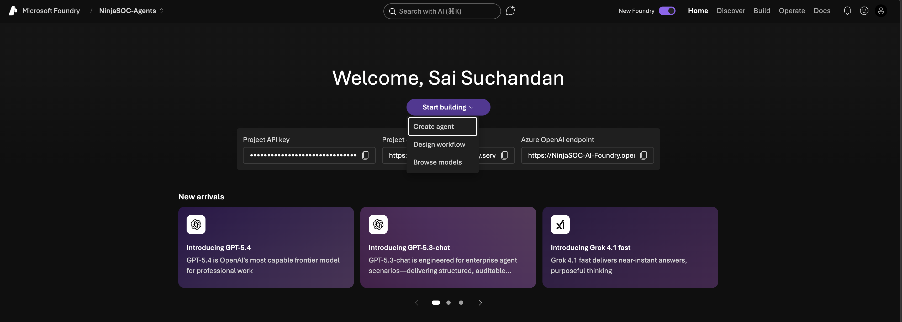
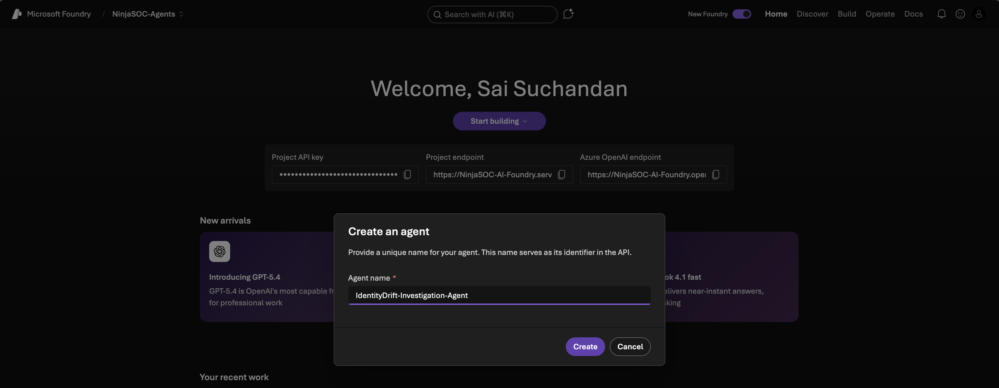
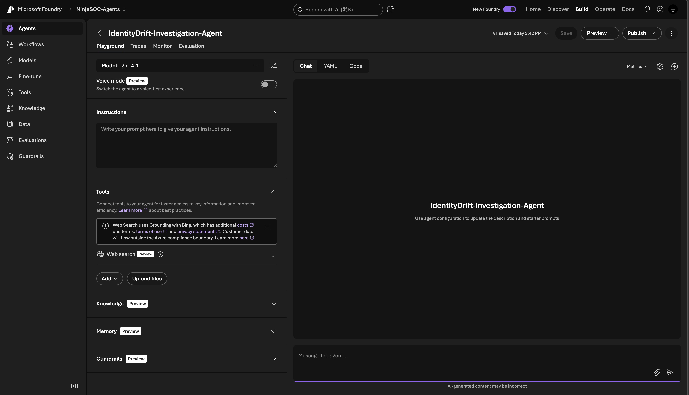
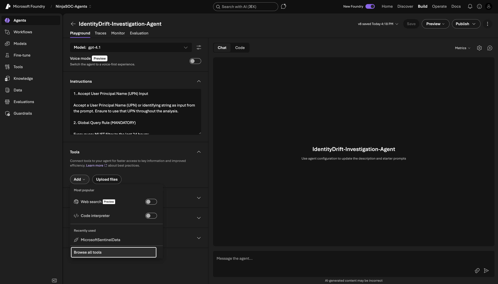
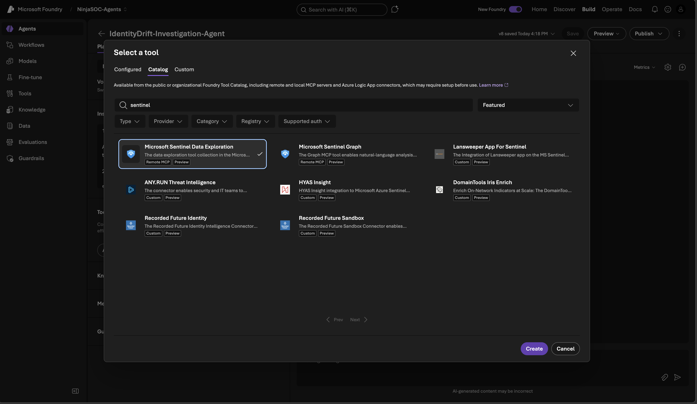
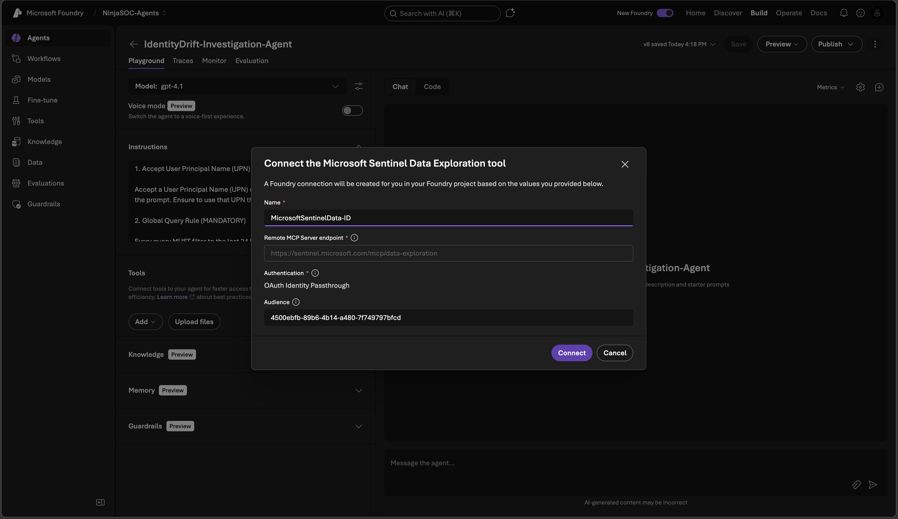
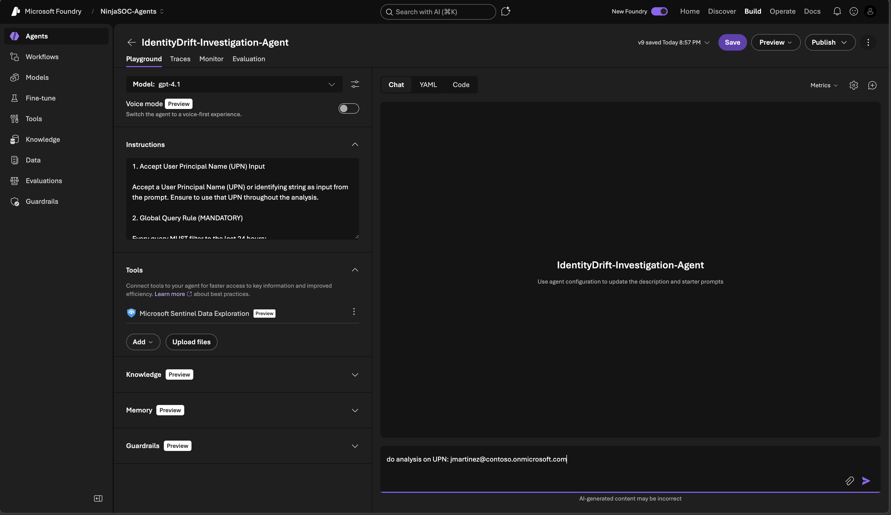
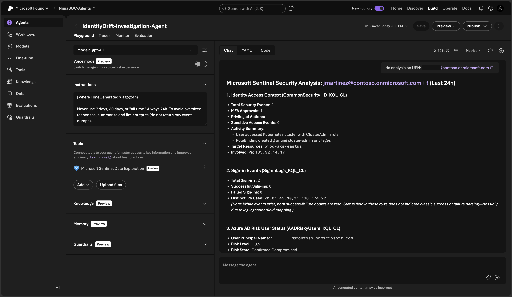
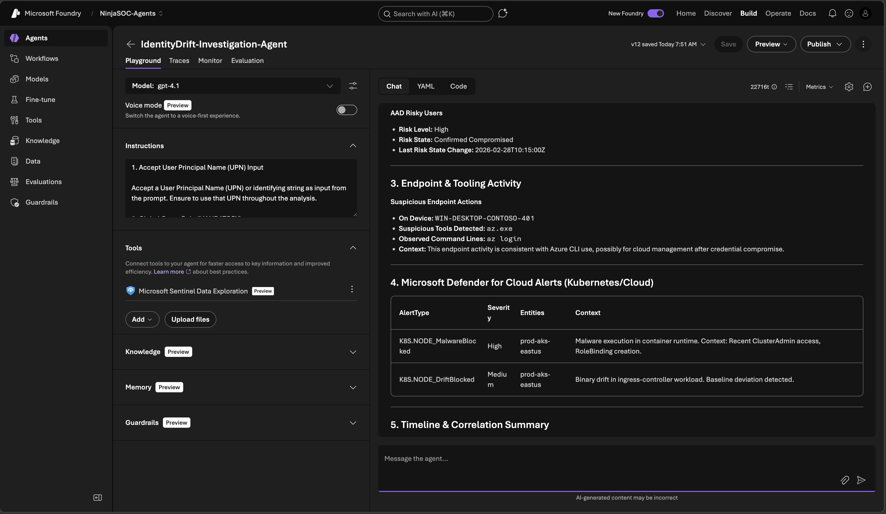
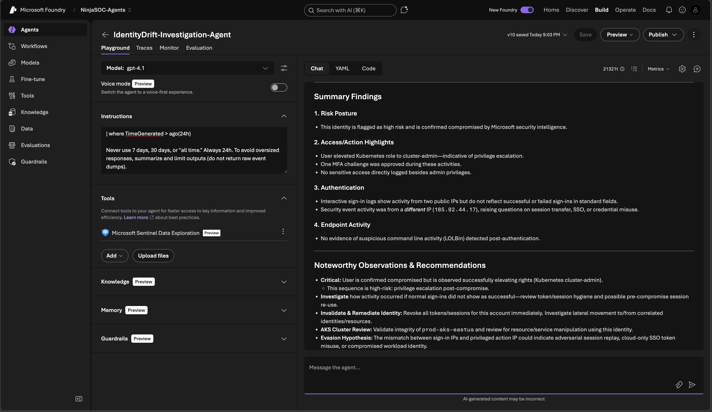

# Building an Agent in Azure AI Foundry

**Fictional ISV:** IdentityDrift

> **💡 Using AI Foundry as Your Dev Sandbox:** This module uses **Azure AI Foundry as a developer playground** to build, test, and refine agent instructions. Here, you can experiment with agent instructions, validate that agent performs analysis correctly, and iterate on the instructions based on test outcomes. Once you're satisfied with the agent's behavior and investigation outcomes, you'll use these validated instructions to build the agent in **Security Copilot** (Lab 5), test it in that environment, and then publish to the **Security Store** (Lab 6). Think of AI Foundry as your sandbox for rapid prototyping and instruction refinement before building and publishing a Security Copilot Agent.

## 🎯 Lab Objective

In this lab, you will build an Agent that reasons across identity risk, authentication signals, access telemetry, and endpoint activity using fictional IdentityDrift telemetry streamed into Microsoft Sentinel Data Lake.

By the end of this lab, you will understand:

- How fictional ISV telemetry can be modeled realistically in Sentinel
- How to create KQL jobs using datatable for lab scenarios
- How to author Agent instructions that follow grounding rules
- How to create and test an agent using AI Foundry

## 🧠 Lab Storyline (Scenario)

### Correlations

- Risky sign-in events
- User identity and role context
- Access to vulnerable or high-value workloads

### Example

A user signs in from a previously unseen geography, triggering a medium-risk identity alert. On its own, the alert is inconclusive. When correlated with IdentityDrift access telemetry, the user is found to have administrative access to a Kubernetes cluster running an unpatched ingress controller. Additional correlation shows recent privilege escalation activity within the cluster.

### Outcome

The sign-in is treated as an initial access event rather than a benign anomaly, prompting immediate containment of the identity and isolation of the affected workload.

## Step 1️⃣ – Ingest Fictional IdentityDrift Data into Sentinel Data Lake

**CommonSecurity_ID_KQL_CL** represents IdentityDrift identity-aware access telemetry, modeled after how real identity vendors stream post-authentication access context into Sentinel.

### KQL Job – Ingest IdentityDrift Sample Data

Create KQL Job by following the steps in [Create-KQL-Jobs](./02-Create-KQL-Jobs.md)

### KQL Job - Ingest Sample Data for SigninLogs, AADRiskyUsers, DeviceProcessEvents and SecurityAlerts

At this stage, the same user identity should appear across:

- [SigninLogs_KQL_CL](KQL-Jobs/SigninLogs) 
- [AADRiskyUsers_KQL_CL](KQL-Jobs/AADRiskyUsers)
- [DeviceProcessEvents_KQL_CL](KQL-Jobs/DeviceProcessEvents)
- [SecurityAlerts](KQL-Jobs/SecurityAlerts)

## Step 2️⃣ – Create the Agent in AI Foundry

#### Navigate to Azure AI Foundry
1. Open your web browser and navigate to **https://ai.azure.com/**
2. Sign in with your organizational credentials that have access to Azure AI Foundry
3. Select your **AI Foundry project** from the available options

### Step 2: Create AI Agent

1. Click Start Building and Select Create Agent



2. Provide Name of the Agent as **IdentityDrift-Investigation-Agent**



3. Add Agent Instructions and Add Tools to select Sentinel Data Exploration MCP Server. 



### IdentityDrift Agent Instructions

```
1. Accept User Principal Name (UPN) Input

Accept a User Principal Name (UPN) or identifying string as input from the prompt. Ensure to use that UPN throughout the analysis.

2. Global Query Rule (MANDATORY)

Every query MUST filter to the last 24 hours:

| where TimeGenerated > ago(24h)

Never use 7 days, 30 days, or "all time." Always 24h. To avoid oversized responses, summarize and limit outputs (do not return raw event dumps).

3. Query Data Lake for CommonSecurity_ID_KQL_CL

IMPORTANT:

- Do NOT assume the existence of any specific columns such as Action, EventType, or Application
- Use only columns that exist in the query result
- Prefer the following safe fields when available:
  - TimeGenerated
  - SourceUserName
  - SourceIP
  - DestinationHostName
  - AdditionalExtensions
  - DeviceCustomString1

Search CommonSecurity_ID_KQL_CL table records for events that match the provided user input (use SourceUserName as the identifier).

Sample KQL Query (replace {{UserPrincipalName}}):

CommonSecurity_ID_KQL_CL
| where TimeGenerated > ago(24h)
    and SourceUserName has '{{UserPrincipalName}}'
| summarize
    TotalEvents=count(),
    MFA_Approved=countif(DeviceCustomString1 has "Approved"),
    PrivilegedActions=countif(DeviceCustomString1 has "Privilege"),
    SensitiveAccess=countif(DeviceCustomString1 has "Sensitive"),
    Activities=makeset(AdditionalExtensions),
    TargetResources=makeset(DestinationHostName),
    IPs=makeset(SourceIP)
    by SourceUserName

4. Query Data Lake SigninLogs_KQL_CL Table

- Same user input
- Filter last 24 hours
- Extract:
  - Sign-in success vs failure
  - IP diversity
  - Result descriptions

5. Query Data Lake AADRiskyUsers_KQL_CL Table

- Same user input
- Filter last 24 hours
- Extract:
  - RiskLevel
  - RiskState
  - RiskLastUpdatedDateTime

6. Query Data Lake DeviceProcessEvents_KQL_CL Table

- Same user input
- Filter last 24 hours
- Identify suspicious post-authentication activity

Guidance:

- Remove domain from UPN to derive AccountName
- Look for LOLBins in FileName column 
  - powershell.exe
  - cmd.exe
  - kubectl.exe
  - az.exe

7. Query Microsoft Defender for Cloud SecurityAlert Table

Query SecurityAlert to identify confirmed runtime threats related to Kubernetes or cloud workloads that may correlate with identity activity.

- Alerts generated by Microsoft Defender for Cloud Kubernetes‑related alert types such as:
  - K8S.NODE_MalwareBlocked
  - K8S.NODE_DriftBlocked

Guidance:

- Filter to last 24 hours
- Do NOT expect user identity fields in SecurityAlert
- Extract:
  - AlertType
  - AlertSeverity
  - CompromisedEntity (ClusterName)
  - Context from ExtendedProperties

8. Correlation & Reasoning

Use the Sentinel Data Exploration MCP tool to correlate activity between CommonSecurity_ID_KQL_CL , SigninLogs_KQL_CL, AADRiskyUsers_KQL_CL, DeviceProcessEvents_KQL_CL and SecurityAlert_KQL_CL

Match overlapping:

- User identifiers
- IP addresses
- Device names
- Authentication privilege escalation
- Suspicious endpoint execution post authentication compromise

9. Surface Key Insights

Identify:

- Risky sign-ins followed by privileged access
- Unexpected MFA approvals
- Access to vulnerable or high-value workloads
- Privilege escalation preceding endpoint activity and Kubernetes control‑plane actions
- Suspicious endpoint or Kubernetes tooling execution
- Defender for Cloud alerts occurring after identity or control‑plane activity

10. Provide Summary Findings

Summarize:

- MFA outcomes
- Sign-in success vs failure trends
- Identity risk posture
- Privileged access highlights
- Endpoint execution signals
- Defender for Cloud security alerts and their timing

Highlight discrepancies or noteworthy observations across identity, access, and endpoint telemetry.

### Sample Automation Flow (Short Version)

1. Query **CommonSecurity_ID_KQL_CL** for identity access context
2. Query **SigninLogs_KQL_CL** and **AADRiskyUsers_KQL_CL** for authentication and risk posture
3. Query **DeviceProcessEvents_KQL_CL** for endpoint behavior
4. Query **SecurityAlert_KQL_CL** for Defender for Cloud runtime threats
5. Correlate all signals using Sentinel MCP and surface actionable security insights
```

4. Select Browse all tools



5. Search for **Sentinel** under **Catalog** tab and select **Microsoft Sentinel Data Exploration**



6. Provide unique name for Tool and connect it to Agent



## Step 3️⃣: Test AI Agent

1. Start testing the Agent by using sample query - **do analysis on UPN: u1291@contoso.onmicrosoft.com**



2. Below are the detailed results from the sample Agent run analyzing **u1291@contoso.onmicrosoft.com**:





