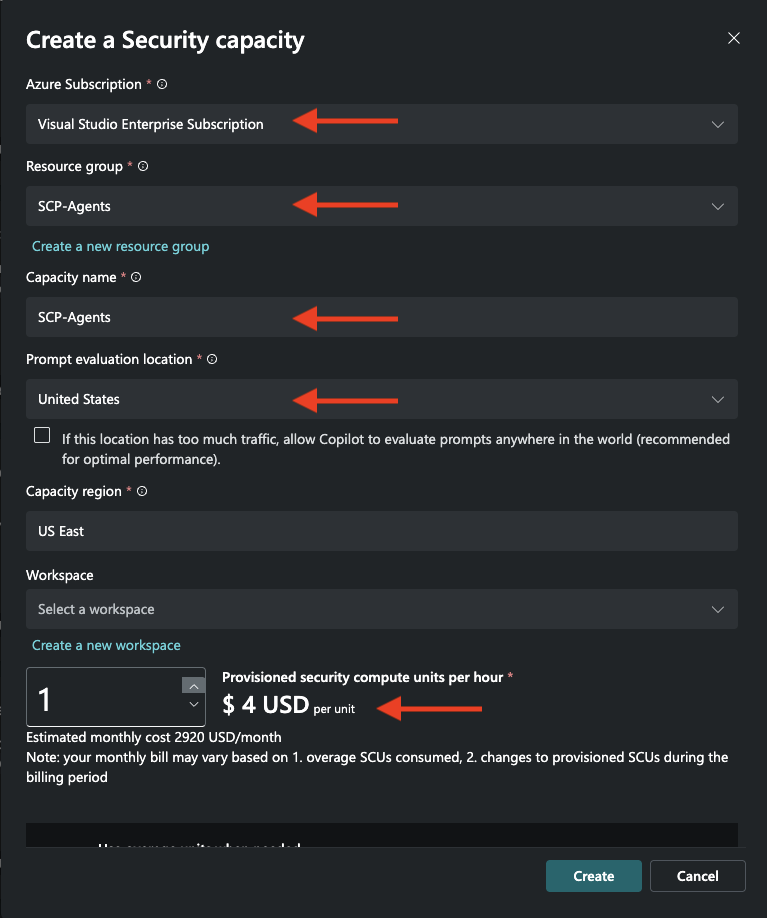
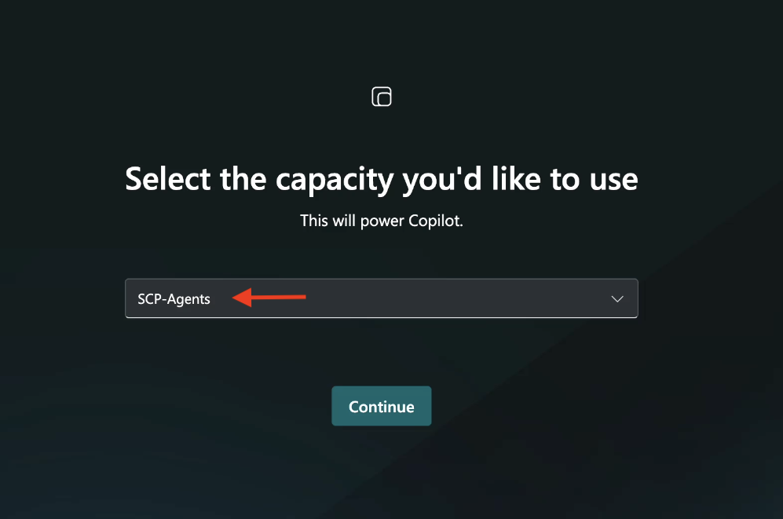
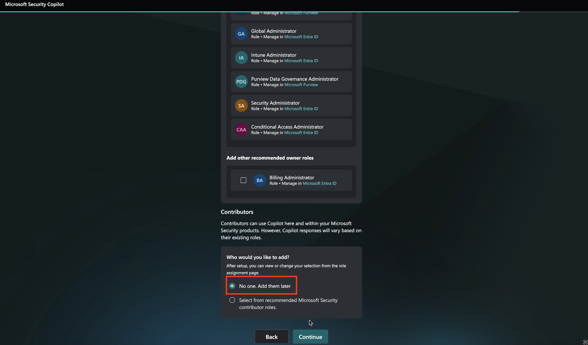
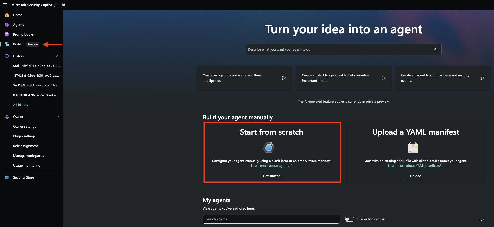
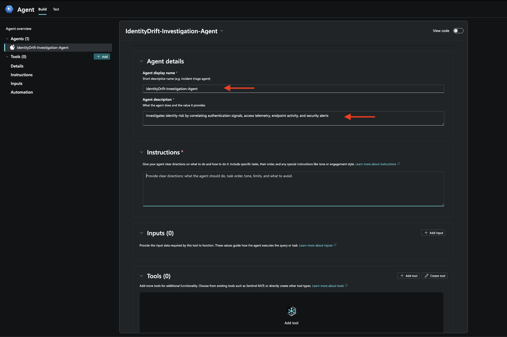
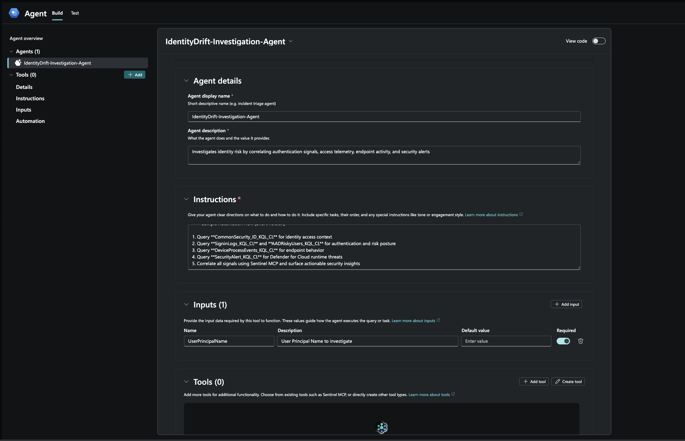
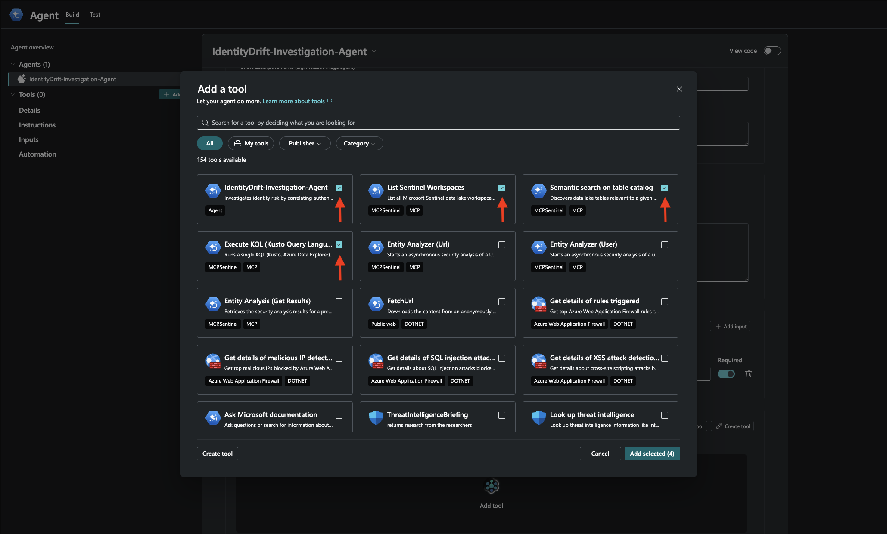
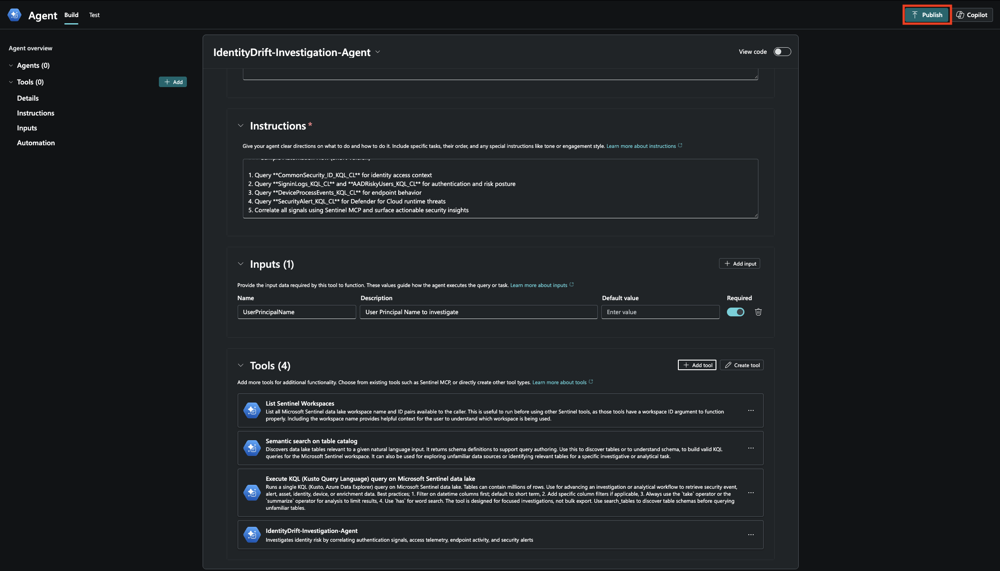
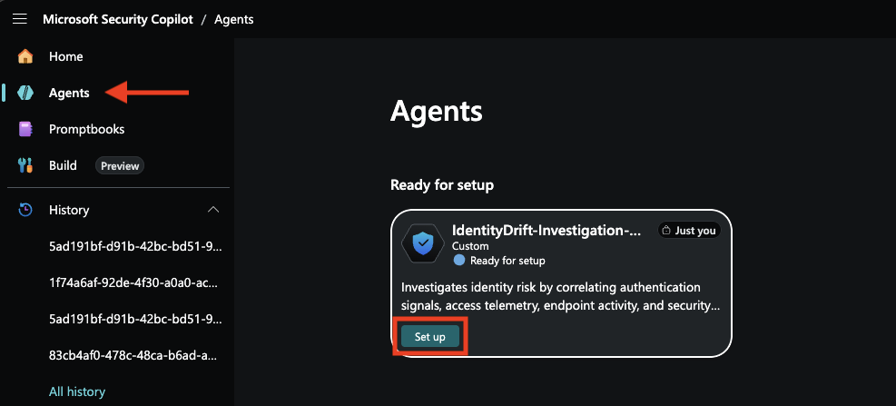
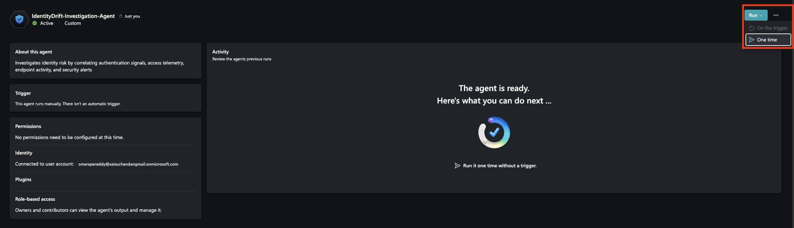

# Building an Agent in Security Copilot

**Fictional ISV:** IdentityDrift

## 🎯 Lab Objective

In this lab, you will build a Security Copilot agent that correlates  IdentityDrift telemetry with Entra, Defender for Endpoint and Cloud alerts by using the Agent Instructions from the . 

By the end of this lab, you will understand:

- How to create and manage Security Copilot workspaces
- How to create and test a Security Copilot agent

## Prerequisites

### Onboarding
You must first complete the previous labs:
- [Lab 1: Sentinel Data Lake Onboarding](./01-Sentinel-DataLake-Onboarding.md)
- [Lab 2: Creating KQL Jobs](./02-Create-KQL-Jobs.md)
- [Lab 4: Building an Agent in Azure AI Foundry](./04-Building-an-Agent-in-Azure-AI-Foundry.md)

### Required Permissions
- User needs **Security Administrator** role to create Secure Compute Units (SCUs) which is prerequisite to run agents in Security Copilot.
- **Security Operator** role is sufficient to create and test Agents

### Required Access
- Access to Security Copilot at https://securitycopilot.microsoft.com/
- Access to Microsoft Sentinel workspace

## Step 1️⃣ – Create a Security Copilot Workspace

### Navigate to Security Copilot
1. Open your web browser and navigate to **https://securitycopilot.microsoft.com/**
2. Sign in with your organizational credentials that have the required permissions

### Create a SCU Capacity and New Workspace

1. On the home page, you will be prompted to create Security Capacity. 
2. Select appropriate **Azure Subscription**, **Resource Group**
3. Add **Capacity name** and select **Prompt evaluation location** and **Capacity region**.
4. Add 1 or 2 SCUs depending on the requirement. 



**Note:** Security Compute Units (SCUs) are billed hourly. To optimize costs during testing, delete your SCU capacity when not actively running agents, and recreate it when needed.

1. Select the SCU Capacity Created and initiate workspace creation
2. You will be prompted with a workspace creation dialog



**Note:** During workspace creation, in the **Assign roles** step, select **"No one. Add them later"** under **Contributors** if you encounter any workspace creation issues.



## Step 2️⃣ – Create the IdentityDrift Investigation Agent

### Navigate to Agent Creation

1. In the workspace, click **Build** and select **Start from scratch**



### Step 1: Agent Configuration

1. **Agent display name:** Enter `IdentityDrift-Investigation-Agent`

2. **Agent description:** Provide a brief description
   - **Example:** Investigates identity risk by correlating authentication signals, access telemetry, endpoint activity, and security alerts



### Step 2: Define Agent Instructions

The agent instructions are critical for defining the agent behavior. Copy the following instructions into the **Instructions** field:

**Note:** These are the same instructions tested in AI foundry as part of [Lab 4: Building an Agent in Azure AI Foundry](./04-Building-an-Agent-in-Azure-AI-Foundry.md). 

#### IdentityDrift Agent Instructions 

```
1. Accept User Principal Name (UPN) Input

Accept a User Principal Name (UPN) or identifying string as input from the prompt. Ensure to use that UPN throughout the analysis.

2. Global Query Rule (MANDATORY)

Every query MUST filter to the last 24 hours:

| where TimeGenerated > ago(24h)

Never use 7 days, 30 days, or "all time." Always 24h. To avoid oversized responses, summarize and limit outputs (do not return raw event dumps).

3. Query Data Lake for CommonSecurity_ID_KQL_CL

IMPORTANT:

- Do NOT assume the existence of any specific columns such as Action, EventType, or Application
- Use only columns that exist in the query result
- Prefer the following safe fields when available:
  - TimeGenerated
  - SourceUserName
  - SourceIP
  - DestinationHostName
  - AdditionalExtensions
  - DeviceCustomString1

Search CommonSecurity_ID_KQL_CL table records for events that match the provided user input (use SourceUserName as the identifier).

Sample KQL Query (replace {{UserPrincipalName}}):

CommonSecurity_ID_KQL_CL
| where TimeGenerated > ago(24h)
    and SourceUserName has '{{UserPrincipalName}}'
| summarize
    TotalEvents=count(),
    MFA_Approved=countif(DeviceCustomString1 has "Approved"),
    PrivilegedActions=countif(DeviceCustomString1 has "Privilege"),
    SensitiveAccess=countif(DeviceCustomString1 has "Sensitive"),
    Activities=makeset(AdditionalExtensions),
    TargetResources=makeset(DestinationHostName),
    IPs=makeset(SourceIP)
    by SourceUserName

4. Query Data Lake SigninLogs_KQL_CL Table

- Same user input
- Filter last 24 hours
- Extract:
  - Sign-in success vs failure
  - IP diversity
  - Result descriptions

5. Query Data Lake AADRiskyUsers_KQL_CL Table

- Same user input
- Filter last 24 hours
- Extract:
  - RiskLevel
  - RiskState
  - RiskLastUpdatedDateTime

6. Query Data Lake DeviceProcessEvents_KQL_CL Table

- Same user input
- Filter last 24 hours
- Identify suspicious post-authentication activity

Guidance:

- Remove domain from UPN to derive AccountName
- Look for LOLBins in FileName column 
  - powershell.exe
  - cmd.exe
  - kubectl.exe
  - az.exe

7. Query Microsoft Defender for Cloud SecurityAlert Table

Query SecurityAlert to identify confirmed runtime threats related to Kubernetes or cloud workloads that may correlate with identity activity.

- Alerts generated by Microsoft Defender for Cloud Kubernetes‑related alert types such as:
  - K8S.NODE_MalwareBlocked
  - K8S.NODE_DriftBlocked

Guidance:

- Filter to last 24 hours
- Do NOT expect user identity fields in SecurityAlert
- Extract:
  - AlertType
  - AlertSeverity
  - CompromisedEntity (ClusterName)
  - Context from ExtendedProperties

8. Correlation & Reasoning

Use the Sentinel Data Exploration MCP tool to correlate activity between CommonSecurity_ID_KQL_CL , SigninLogs_KQL_CL, AADRiskyUsers_KQL_CL, DeviceProcessEvents_KQL_CL and SecurityAlert_KQL_CL

Match overlapping:

- User identifiers
- IP addresses
- Device names
- Authentication privilege escalation
- Suspicious endpoint execution post authentication compromise

9. Surface Key Insights

Identify:

- Risky sign-ins followed by privileged access
- Unexpected MFA approvals
- Access to vulnerable or high-value workloads
- Privilege escalation preceding endpoint activity and Kubernetes control‑plane actions
- Suspicious endpoint or Kubernetes tooling execution
- Defender for Cloud alerts occurring after identity or control‑plane activity

10. Provide Summary Findings

Summarize:

- MFA outcomes
- Sign-in success vs failure trends
- Identity risk posture
- Privileged access highlights
- Endpoint execution signals
- Defender for Cloud security alerts and their timing

Highlight discrepancies or noteworthy observations across identity, access, and endpoint telemetry.

### Sample Automation Flow (Short Version)

1. Query **CommonSecurity_ID_KQL_CL** for identity access context
2. Query **SigninLogs_KQL_CL** and **AADRiskyUsers_KQL_CL** for authentication and risk posture
3. Query **DeviceProcessEvents_KQL_CL** for endpoint behavior
4. Query **SecurityAlert_KQL_CL** for Defender for Cloud runtime threats
5. Correlate all signals using Sentinel MCP and surface actionable security insights
```

### Step 3: Configure Inputs

Define `UserPrincipalName` as the input to get user identity to perform investigation on.



### Step 4: Add Tools

1. In the **Tools** section, click **Add tool** and select the following **Sentinel MCP** skills and our Agent:

   - List Sentinel Workspaces
   - Semantic search on table catalog
   - Execute KQL (Kusto Query Language) query
   - IdentityDrift-Investigation-Agent



### Step 5: Publish Agent

1. Click **Publish** and select the appropriate **scope**:
   - **Myself** – Agent is available only to you
   - **Everyone in my workspace** – Agent is shared with all workspace members



## Step 3️⃣ – Set up the IdentityDrift Investigation Agent

1. In your Security Copilot workspace, navigate to **Agents**
2. Find and click setup on **IdentityDrift-Investigation-Agent**
3. Complete the Signin and finish Agent setup. 




### Step 4️⃣ – Run the IdentityDrift Investigation Agent

1. Click **Run**, select **One time** and provide **UserPrincipalName** to investigate




### Related Labs
- [Lab 1: Sentinel Data Lake Onboarding](./01-Sentinel-DataLake-Onboarding.md)
- [Lab 2: Creating KQL Jobs](./02-Create-KQL-Jobs.md)
- [Lab 4: Building an Agent in Azure AI Foundry](./04-Building-an-Agent-in-Azure-AI-Foundry.md)

### References
For more detailed information, see:
- [Create and manage Security Copilot workspaces](https://learn.microsoft.com/en-us/copilot/security/manage-workspaces)
- [Build and configure custom agents in Security Copilot](https://learn.microsoft.com/id-id/copilot/security/developer/create-agent-dev)
- [Security Copilot plugins and data source integration](https://learn.microsoft.com/en-us/copilot/security/overview)
