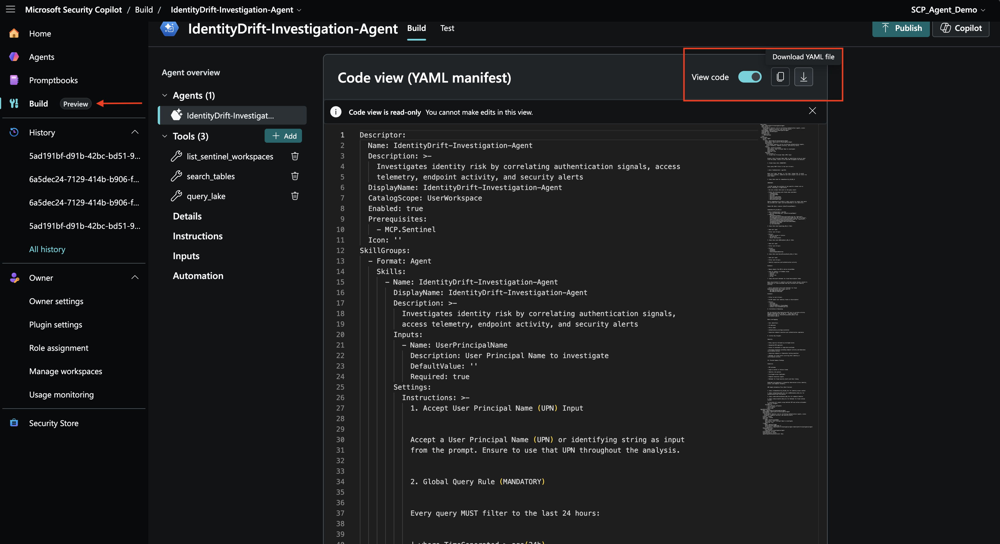

# Lab 06: Publishing Your Security Copilot Agent to the Security Store

## Overview

This module guides you through the process of publishing a Microsoft Security Copilot agent to the Security Store. After building and testing your agent, you'll package it for distribution and list it in Microsoft's Security Store marketplace, making it available to customers.

## Prerequisites

- Completed Lab 05: Building an Agent in Security Copilot
- A working Security Copilot agent with agent manifest
- Microsoft Partner Center account

## Architecture Overview

The publishing process involves:

```
Agent Development
    ↓
Create Deployment Package (.zip)
    ↓
Create SaaS Offer in Partner Center
    ↓
Configure Offer Metadata & Listing
    ↓
Review and publish
    ↓
Live in Security Store
```

## Task 1: Create the Deployment Package

### Step 1.1: Prepare Your Package Structure

Create a folder structure for your agent with the following layout:

```
agent-package/
├── PackageManifest.yaml (required)
└── YourAgentName/
    └── AgentManifest.yaml (required)
```

### Step 1.2: Create PackageManifest.yaml

The manifest file describes your package structure and contents. Create `PackageManifest.yaml` in the root:

```yaml
manifest:
  - id: "IdentityDriftInvestigationAgent"
    description: "Agent to investigate Identity Threats"
    type: CopilotAgent
schema:
  version: "1.0.0"
```

**Key Fields:**
- `id`: Name of your Security Copilot Agent (with no spaces)
- `type`: CopilotAgent for Security Copilot agents (other types: `SentinelLake` (for notebooks))

### Step 1.3: Download Agent Manifest 

The `AgentManifest.yaml` is exported from Microsoft Security Copilot after building and running your agent. You can download it from [Security Copilot](https://securitycopilot.microsoft.com) under the agent **Build** tab and select the agent. 



<details>
  <summary><b>IdentityDrift-Investigation-Agent AgentManifest.yaml file - Click to expand!</b></summary>
<pre>
Descriptor:
  Name: IdentityDrift-Investigation-Agent
  Description: >-
    Investigates identity risk by correlating authentication signals, access
    telemetry, endpoint activity, and security alerts
  DisplayName: IdentityDrift-Investigation-Agent
  CatalogScope: UserWorkspace
  Enabled: true
  Prerequisites:
    - MCP.Sentinel
  Icon: ''
SkillGroups:
  - Format: Agent
    Skills:
      - Name: IdentityDrift-Investigation-Agent
        DisplayName: IdentityDrift-Investigation-Agent
        Description: >-
          Investigates identity risk by correlating authentication signals,
          access telemetry, endpoint activity, and security alerts
        Inputs:
          - Name: UserPrincipalName
            Description: User Principal Name to investigate
            DefaultValue: ''
            Required: true
        Settings:
          Instructions: >-
            1. Accept User Principal Name (UPN) Input


            Accept a User Principal Name (UPN) or identifying string as input
            from the prompt. Ensure to use that UPN throughout the analysis.


            2. Global Query Rule (MANDATORY)


            Every query MUST filter to the last 24 hours:


            | where TimeGenerated > ago(24h)


            Never use 7 days, 30 days, or "all time." Always 24h. To avoid
            oversized responses, summarize and limit outputs (do not return raw
            event dumps).


            3. Query Data Lake for CommonSecurity_ID_KQL_CL


            IMPORTANT:


            - Do NOT assume the existence of any specific columns such as
            Action, EventType, or Application

            - Use only columns that exist in the query result

            - Prefer the following safe fields when available:
              - TimeGenerated
              - SourceUserName
              - SourceIP
              - DestinationHostName
              - AdditionalExtensions
              - DeviceCustomString1

            Search CommonSecurity_ID_KQL_CL table records for events that match
            the provided user input (use SourceUserName as the identifier).


            Sample KQL Query (replace {{UserPrincipalName}}):


            CommonSecurity_ID_KQL_CL

            | where TimeGenerated > ago(24h)
                and SourceUserName has '{{UserPrincipalName}}'
            | summarize
                TotalEvents=count(),
                MFA_Approved=countif(DeviceCustomString1 has "Approved"),
                PrivilegedActions=countif(DeviceCustomString1 has "Privilege"),
                SensitiveAccess=countif(DeviceCustomString1 has "Sensitive"),
                Activities=makeset(AdditionalExtensions),
                TargetResources=makeset(DestinationHostName),
                IPs=makeset(SourceIP)
                by SourceUserName

            4. Query Data Lake SigninLogs_KQL_CL Table


            - Same user input

            - Filter last 24 hours

            - Extract:
              - Sign-in success vs failure
              - IP diversity
              - Result descriptions

            5. Query Data Lake AADRiskyUsers_KQL_CL Table


            - Same user input

            - Filter last 24 hours

            - Extract:
              - RiskLevel
              - RiskState
              - RiskLastUpdatedDateTime

            6. Query Data Lake DeviceProcessEvents_KQL_CL Table


            - Same user input

            - Filter last 24 hours

            - Identify suspicious post-authentication activity


            Guidance:


            - Remove domain from UPN to derive AccountName

            - Look for LOLBins in FileName column 
              - powershell.exe
              - cmd.exe
              - kubectl.exe
              - az.exe

            7. Query Microsoft Defender for Cloud SecurityAlert Table


            Query SecurityAlert to identify confirmed runtime threats related to
            Kubernetes or cloud workloads that may correlate with identity
            activity.


            - Alerts generated by Microsoft Defender for Cloud
            Kubernetes‑related alert types such as:
              - K8S.NODE_MalwareBlocked
              - K8S.NODE_DriftBlocked

            Guidance:


            - Filter to last 24 hours

            - Do NOT expect user identity fields in SecurityAlert

            - Extract:
              - AlertType
              - AlertSeverity
              - CompromisedEntity (ClusterName)
              - Context from ExtendedProperties

            8. Correlation & Reasoning


            Use the Sentinel Data Exploration MCP tool to correlate activity
            between CommonSecurity_ID_KQL_CL , SigninLogs_KQL_CL,
            AADRiskyUsers_KQL_CL, DeviceProcessEvents_KQL_CL and
            SecurityAlert_KQL_CL


            Match overlapping:


            - User identifiers

            - IP addresses

            - Device names

            - Authentication privilege escalation

            - Suspicious endpoint execution post authentication compromise


            9. Surface Key Insights


            Identify:


            - Risky sign-ins followed by privileged access

            - Unexpected MFA approvals

            - Access to vulnerable or high-value workloads

            - Privilege escalation preceding endpoint activity and Kubernetes
            control‑plane actions

            - Suspicious endpoint or Kubernetes tooling execution

            - Defender for Cloud alerts occurring after identity or
            control‑plane activity


            10. Provide Summary Findings


            Summarize:


            - MFA outcomes

            - Sign-in success vs failure trends

            - Identity risk posture

            - Privileged access highlights

            - Endpoint execution signals

            - Defender for Cloud security alerts and their timing


            Highlight discrepancies or noteworthy observations across identity,
            access, and endpoint telemetry.


            ### Sample Automation Flow (Short Version)


            1. Query **CommonSecurity_ID_KQL_CL** for identity access context

            2. Query **SigninLogs_KQL_CL** and **AADRiskyUsers_KQL_CL** for
            authentication and risk posture

            3. Query **DeviceProcessEvents_KQL_CL** for endpoint behavior

            4. Query **SecurityAlert_KQL_CL** for Defender for Cloud runtime
            threats

            5. Correlate all signals using Sentinel MCP and surface actionable
            security insights
        ChildSkills:
          - list_sentinel_workspaces
          - search_tables
          - query_lake
AgentDefinitions:
  - Name: IdentityDrift-Investigation-Agent
    DisplayName: IdentityDrift-Investigation-Agent
    Description: >-
      Investigates identity risk by correlating authentication signals, access
      telemetry, endpoint activity, and security alerts
    Product: IdentityDrift
    Publisher: IdentityDrift
    Settings:
      - Name: UserPrincipalName
        Description: User Principal Name to investigate
        Required: true
    Triggers:
      - Name: DefaultTrigger
        DefaultPollPeriodSeconds: 0
        ProcessSkill: IdentityDrift-Investigation-Agent.IdentityDrift-Investigation-Agent
    RequiredSkillsets:
      - MCP.Sentinel
      - IdentityDrift-Investigation-Agent
    PreviewState: Private
    PublisherSource: Custom
    AgentSingleInstanceConstraint: None
</pre>
</details>

> ### 💡 Tips & Tricks — AgentManifest.yaml Common Review Failures
>
> The Security Store review team runs a thorough validation on `AgentManifest.yaml` before approving offer. The following are the **most common failure points** observed:
>
> ### 1. `product` and `publisher` must be the ISV name — not generic values
> - The `product` and `publisher` fields under `AgentDefinitions` must reflect the ISV's **actual product name and company name**. Do NOT leave them as default values like `"Custom"` after downloading **AgentManifest.yaml** from [Security Copilot](https://securitycopilot.microsoft.com/). 
> ```yaml
> # ❌ Wrong
>AgentDefinitions:
>   Product: Custom
>   Publisher: Custom
>
> # ✅ Correct
> AgentDefinitions:
>   Product: Acme ThreatOps
>   Publisher: Acme Inc.
> ```
>
> ### 2. Settings key names must EXACTLY match Skill input names (no spaces, case-sensitive)
> - If your Skill declares an input named `UserPrincipalName`, the `Settings` section under `AgentDefinitions` must use exactly `UserPrincipalName` — NOT `User Principal Name` (with spaces). 
> ```yaml
> # ❌ Wrong — spaces in key name
> Settings:
>   - Name: User Principal Name
>
> # ✅ Correct — matches exact input key name
> Settings:
>   - Name: UserPrincipalName
> ```
>
> ### 3. Input fields must include a `Description` property
> - Every input/setting field must have a meaningful `Description` that helps the user understand what value to provide. Without descriptions, users hovering over input fields in Security Copilot see nothing.
>
> ### 4. Skill names must be descriptive — not version labels or random characters
> - When defining Custom Skills in Security Copilot Agent, the Skill names like `"Agent v3"`, or `"Skill_01"` are rejected because they do not convey what the skill does. 
> Name skills after their action and target, e.g., `"GetSignInLogsForUser"`, `"QueryRiskyUsersTable"`, `"CorrelateEndpointActivity"`.
>
> ### 5. `RequiredSkillsets` must include all integrated Microsoft products
> - If your agent integrates with Microsoft Sentinel Data Exploration or other Sentinel MCP tools, add `MCP.Sentinel` to `RequiredSkillsets`. This is important not just for standards alignment — when `MCP.Sentinel` is listed, Sentinel visibly appears under the **Plugins** section in the agent run view, which is required for passing the screenshot validation during review.
> ```yaml
> RequiredSkillsets:
>   - MCP.Sentinel
> ```
>
> ### 6. Never hardcode time windows in KQL — use input parameters
> - KQL queries with hardcoded `ago(7d)` or similar values are flagged as inflexible. Replace them with input parameters so the time window is configurable:
> ```yaml
> # ❌ Wrong — hardcoded time window
> Template: >-
>   SigninLogs | where TimeGenerated > ago(7d) ...
>
> # ✅ Correct — parameterized time window
> Template: >-
>   SigninLogs | where TimeGenerated > ago({{TimeRange}}) ...
> ```
>
> ### 7. Grammar and spelling audit
> - The review team checks every text field: `Descriptor.Description`, `SkillGroups` skill descriptions, input descriptions, `DisplayName` fields. Grammatical errors like "for a specific given username" (redundant phrasing) or unnecessary capitalization throughout are flagged. Run a full grammar check on all YAML text fields before packaging.


### Step 1.5: Create ZIP Package

**For Windows/Linux:**
```bash
cd agent-package
zip -r agent-package.zip .
```

**For Mac (important - avoids hidden files):**

Open Terminal and navigate to your agent package folder:

```bash
cd /path/to/agent-package
zip -r agent-package.zip . -x ".*" -x "__MACOSX"
```

This command creates `agent-package.zip` while excluding:
- Hidden files (starting with `.`)
- macOS system folders (`__MACOSX`)

**Verify Package Contents:**

```bash
unzip -l agent-package.zip
```

You should see:
```
PackageManifest.yaml
YourAgentName/
YourAgentName/AgentManifest.yaml
```

## Task 2: Prepare for Partner Center Publication

### Step 2.1: Gather Required Information

Before creating your offer, collect the following:

- Agent name and version (**must NOT contain Microsoft product names**)
- Agent description (1-2 sentences)
- Agent tasks (list of what the agent does)
- Agent workflow — explicit Inputs and Outputs with data sources/table names
- Marketing / product page URL (for the Links section — required)
- User guide document (PDF) describing how to install and use the agent from the Security Store
- ISV Logo (216×216 px) and Agent Screenshots (1280×720 px) showing full agent execution and results
- Webhook URL (for order notifications)
- Pricing model (free or paid)
- SCU consumption estimate 

> ### 💡 Tip — Prepare Agent Description Before Starting in Partner Center
> - The Security Store review team requires the offer description to include a structured format covering Agent Tasks, Inputs, and Outputs. Below is the expected format:
>
> ```
> [Agent name] is a security investigation agent that integrates with Microsoft Sentinel to [brief purpose statement].
>
> Agent Tasks:
> - Task 1 (e.g., Identity threat triage)
> - Task 2 (e.g., Authentication analysis)
> - Task 3 (e.g., Cross-telemetry correlation and anomaly detection)
>
> Agent Workflow:
>
> Input:
> - UserPrincipalName (UPN) — the user account to investigate
> - Access to Microsoft Sentinel Data Lake tables (TableA_CL, TableB_CL, ...)
> - Time range used for queries: TimeGenerated > ago(24h)
>
> Output:
> - MFA activity summary
> - Sign-in success and failure summary with distinct IP addresses
> - User risk level and risk state summary
> - Suspicious process execution summary
> - Correlated identity-to-endpoint insights
> - Concise triage summary report with investigation-ready findings
> ```
>
> Refer to existing published agents in the [Security Store](https://securitystore.microsoft.com) or [Silverfort Identity Threat Triage Agent](https://securitystore.microsoft.com/solutions/silverfort.silverfort-scp-agent) for formatting examples.
>
> ### 💡 Tip — Measure SCU Consumption
> - The Plan description in Partner Center is required to include an SCU consumption estimate. Before starting your offer on Partner Center submission, run your agent 3–5 times under typical scenarios and record the SCU usage shown after each run in Security Copilot. Take the average and round up. You will add this to the Plan description as an example: **"This agent typically consumes 1.0 SCU per analysis run."**


---

## Task 3: Create and Configure Your Offer in Partner Center

### Step 3.1: Access Microsoft Partner Center

1. Go to [Microsoft Partner Center](https://partner.microsoft.com/dashboard)
2. Sign in with your login details
3. Navigate to **Marketplace offers**

### Step 3.2: Create New SaaS offer or Clone Existing offer

1. Click **New offer**
2. Select **Software as a Service (SaaS)** as the offer type
3. Select **Start with a blank offer** or **Clone an existing offer**
> 💡 Tip - If you have an existing SaaS offer in Partner Center, **clone it** to reduce setup time. Cloning automatically carries forward your logo, legal documentation, privacy policy links, and other common metadata. You'll then only need to update security copilot agent specific content.
3. Enter offer details: (Example)
   - **Offer ID:** `identity-drift-agent` (lowercase, hyphens)
   - **Alias:** `IdentityDrift Investigation Agent`
4. Click **Create**

---

> ### 📖 Important: Parallel Reading with Official Documentation
> 
> **The subsequent steps in this lab module are intended as supplementary guidance** that complements the official Microsoft documentation. To ensure you follow the most current Partner Center workflow and best practices, **please use this lab guide in parallel with** - **[Publish a Security Copilot Agent in Security Store](https://learn.microsoft.com/en-us/security/store/publish-a-security-copilot-agent-or-analytics-solution-in-security-store#publish-an-offer-in-the-partner-center)**

---

### Step 3.3: Configure Offer Setup

On the Offer setup page:

1. **Would you like to sell through Microsoft?** → Select **Yes**
2. **Would you like to use Microsoft license management?** → Select **No**
3. **Customer leads:** Optional - connect your CRM if desired
4. **Microsoft integrations:** ✓ Check *"My offer integrates with Microsoft Security services"*
5. Click **Save draft**

> ### 💡 Tip — Critical: Enable Microsoft Security Services Integration
> - Checking **"My offer integrates with Microsoft Security services"** in Step 3.3 above is critical. Without enabling this checkbox, the **"Microsoft Security services"** option will NOT appear in the left navigation menu of your offer. This is the section where you upload your agent package `.zip` file. 

### Step 3.4: Fill in metadata properties

1. Go to **Properties**
2. **Categories:** Select **Security or Compliance** (primary category)
3. **Industries:** Leave blank
4. **Legal contract:** Choose Standard Contract or provide your own
5. Click **Save draft**

### Step 3.5: Configure Offer Listing

1. Go to **Offer listing** in left menu
2. Fill in required fields:

   **Search results summary** (single line):
   > "Investigation  agent that automates security incident investigation and response"

   **Description** prepared earlier in a structured format outlining agent tasks, inputs, and outputs.

3. Add images:
   - Logo (216 x 216 px)
   - Screenshots (1280 x 720 px)
4. Upload User guide under **Product information documents**
5. Click **Save draft**

> ### 💡 Tip — Agent Name Must NOT Contain Microsoft Product Names
> - The third-party agent name in Partner Center **must not** contain any Microsoft product names, including `"Security Copilot"`, `"Microsoft Sentinel"`, `"Microsoft Defender"`, `"Entra"`, etc.
> ```
> ❌ "Acme Security Copilot Investigation Agent"
> ✅ "Acme Identity Threat Triage Agent"
> ```
> Check ALL locations: the offer name, the plan name, and the description text.
>
> ### 💡 Tip — Offer listing: Links and User Guide
> - Two fields in the Offer listing which are commonly missed and cause review failures:
>
> 1. **Marketing/Product page link:** 
> - Under **Offer listing → Supplemental product information for customers → Product information links → Links**, add the URL to your product marketing page or documentation page. 
>
> 2. **User guide document:** 
> - Upload user guide PDF under **Offer listing → Supplemental product information for customers → Product information documents**. This document must include a details for users to learn more about the agent and find instructions to install or use it.
> - For reference, see the [Silverfort Identity Threat Triage Agent User Guide](https://catalogartifact.azureedge.net/publicartifacts/silverfort.silverfort-scp-agent-fe6c572a-80dc-491c-974e-412163852c84/Artifacts/Documents/Silverfort-Identity-Threat-Triage-Agent-User-Guide.pdf)
>
> ### 💡 Tip — Screenshots Must Show Full Agent Execution and Results
> - Screenshots are validated by the review team. Screenshots that show only configuration screens, setup pages, or UI without a running agent are rejected. At least one screenshot must:
>   - Show the agent **actively running** and returned results.
>   - Show the integrated Microsoft product (e.g., **Microsoft Sentinel**) visibly listed under the **Plugins** section in the agent view
>   - Screenshot resolution must be **1280×720 px**. Use [https://imageresizer.com](https://imageresizer.com) to resize if needed.
>
> ### 💡 Tip — To get Microsoft Sentinel to appear under Plugins:
> - Add `MCP.Sentinel` to `RequiredSkillsets` in your `AgentManifest.yaml`.

### Step 3.6: Add Microsoft Security Services Metadata

1. Go to **Microsoft Security services** in left menu
2. Configure metadata:

   | Field | Value |
   |-------|-------|
   | **Integrated Security services** | ✓ Microsoft Security Copilot ✓ Microsoft Sentinel (as applicable) |
   | **Product prerequisites** | ✓ Microsoft Security Copilot ✓ Microsoft Sentinel, ✓ Microsoft Defender, ✓ Microsoft Entra (as applicable)  |
   | **Solution type** | ✓ Deployable solution |
   | **License management** | Choose based on your model |

3. **Security Copilot agent:**
   - ✓ Check "Security Copilot agent"

4. **Upload Solution Package:**
   - Click **Upload .zip package**
   - Select your `agent-package.zip` file
    
5. Click **Save draft**

> ### 💡 Tip — Integrated Microsoft Security Products Selection Must Match Agent Description
> - The **Integrated Microsoft Security Products** selection must accurately reflect what your agent actually integrates with in the description and in practice. Common mismatches that are hard fails:
>   - Agent description mentions Sentinel Data Lake queries but only "Security Copilot" is selected → Add "Microsoft Sentinel"
>   - Agent description mentions Defender alerts but "Microsoft Sentinel" is selected → Add "Microsoft Defender"
>
> The selection drives which filter the agent appears under in the Security Store (e.g., users filtering by "Microsoft Sentinel" will only see agents that have Microsoft Sentinel selected here).

## Task 4: Add Preview audience

### Step 4.1: Add Preview Audience

1. Go to **Preview audience** in left menu
2. Enter Microsoft Entra IDs of internal users who will test:
   - Team members
   - QA testers
3. Click **Save draft**

### Step 4.2: Access Preview

1. Users added to preview audience can access:
   - Landing page
   - Offer listing
   - Full deployment flow
2. Share preview URL with test audience
3. Gather feedback on: (Example)
   - Listing accuracy
   - Deployment steps
   - Documentation

**Reference**: [How to preview and test your offer listing for Security Store](https://learn.microsoft.com/en-us/security/store/preview-and-test-your-offer-listing-for-security-store)

## Task 5: Technical Configuration

1. Go to **Technical configuration** in left menu
2. Fill in required fields:

   | Field | Value |
   |-------|-------|
   | **Landing page URL** | `https://securitystore.microsoft.com/mysolutions` |
   | **Connection webhook** | Your webhook URL for order/subscription notifications |
   | **Microsoft Entra tenant ID** | Your tenant ID |
   | **Microsoft Entra app ID** | Your app ID |

3. Click **Save draft**

> ### 💡 Tip — Technical Configuration is Mandatory and Blocks Submission
> - Partner Center will **block the "Review and Publish" button** if Technical Configuration is not fully filled in — even if your organization does not plan to use telemetry or license management webhooks. This is a required section for all SaaS offers on the Microsoft commercial marketplace.
>
> **If you are not ready to implement a webhook:**
> - Use **dummy/placeholder values** for the Landing page URL, webhook, tenant ID, and app ID
> - These values can be updated later by modifying and republishing the same offer
>
> **Webhook setup guidance:** [Implementing a webhook on the SaaS service - Marketplace publisher](https://learn.microsoft.com/en-us/partner-center/marketplace-offers/pc-saas-fulfillment-webhook).

## Task 6: Create Plan and Pricing

#### For Free Agents:

1. Go to **Plan overview** in left menu
2. Click **Create new plan**
3. Enter:
   - **Plan name:** `Identity Drift Investigation Agent plan` (do NOT include Microsoft product names in plan name)
   - **Plan description:** `Free tier offering of our agent` -  Include SCU consumption estimate — see Tip below
4. Click **Edit Markets**
5. Select regions where you want to offer (recommend **Select all**)
6. Set **Pricing model:** Flat rate
7. Set **Contract duration**, **Billing Frequency**, **Price per charge:** $0 USD
8. **Plan visibility:** Set to **Public** (or **Private** for specific customers)
9. Click **Save draft**

#### For Paid Agents:

1. Follow same steps as above
2. **Pricing model:** Choose between:
   - **Flat rate** - Fixed monthly/annual fee
   - **Per user** - Price per licensed user
3. **Contract duration:** 1 month, 1 year, 3 years, etc.
4. **Billing frequency:** Monthly or annual
5. **Price per charge:** Set your pricing
6. Optional: ✓ Check **Free trial** for 1-month trial period
7. **Plan visibility:** Set to **Public** (or **Private** for specific customers)
8. Click **Save draft**

> ### 💡 Tip — Plan Description Must Include SCU Consumption Estimate
> - The Plan description is required to include an estimate of SCU consumption. Add a clear statement such as:
>
> *"This agent typically consumes 1.0 SCU per analysis run."*
>
> To learn more about how to estimate SCU usage, see [Manage usage - Microsoft Security Copilot](https://learn.microsoft.com/en-us/copilot/security/manage-usage).
>
> ### 💡 Tip - Example full Plan description:
> ```
> The Acme Identity Threat Triage Agent is available at no cost. This agent typically consumes 1.0 SCU per analysis run. SCU consumption may vary depending on the volume of data in your Microsoft Sentinel workspace and the complexity of the investigation.
> ```

## Task 7: Supplement content

1. Select **SaaS Scenarios** - SaaS solution is not hosted in Azure.
2. In the **text box**, enter the following note: **Offer listing is for Security Copilot Agent in Microsoft Security Store.**
3. Upload Product documentation and select category **Architecture diagram**

## Task 8: Publish Your Agent

### Step 8.1: Final Review Checklist

Before publishing, verify:

- All required fields completed
- Offer listing is grammatically correct and accurate
- Agent name does NOT contain Microsoft product names ("Security Copilot", "Microsoft Sentinel", etc.)
- Marketing/product page link added under Offer Listing → Links
- User guide document uploaded under Product information documents
- Logo (216×216 px) and screenshots (1280×720 px)
- At least one screenshot shows full agent execution with integrated product visible under Plugins
- Technical configuration is filled in (dummy values acceptable)
- In AgentManifest.yaml file - in AgentDefinition section `product` and `publisher` fields reflect actual ISV name (not "Custom")
- Plan description includes SCU consumption estimate
- Technical configuration has all required values
- ZIP package is valid and up to date
- Terms and privacy policy links work

### Step 8.2: Submit for Publication

1. Click **Review and publish** (top right of Partner Center)
2. Review all sections
3. If all validation passes, click **Publish**
4. Your offer enters automated review process
5. After the automated review, click **Go Live** to move the request to Security Store team for review and certification

### Step 8.3: Monitor Publication Status

1. Return to Partner Center → **Marketplace Offers**
2. Find your offer
3. Review status indicators:
   - 🟡 **In review** - Being validated by Security Store team
   - 🔴 **Changes required** - Review feedback received, corrections needed
   - 🟢 **Published** - Live in Security Store

### Step 8.4: Verify Live Listing

Once published, verify your listing at:
`https://securitystore.microsoft.com/agents`

Check:
- Agent description displays correctly
- Screenshots are visible
- Links are working

## Troubleshooting

### Package zip file rejected or fails validation

**Problem:** "Invalid package structure"
- **Solution:** Verify `PackageManifest.yaml` is in root directory with correct formatting

**Problem:** "Hidden files included in ZIP"
- **Solution:** On Mac, use: `zip -r package.zip . -x ".*" -x "__MACOSX"`

**Agent name contains Microsoft product name**
- Remove `"Security Copilot"`, `"Microsoft Sentinel"`, `"Microsoft Defender"`, `"Entra"`, or any Microsoft product name from the agent name field in Partner Center
- Check ALL locations: the Offer name, Plan name, and description text body
- Resubmit after fixing all occurrences

**Screenshots rejected — "do not depict functionality of the agent"**
- Screenshots must show a **full agent execution run**, not just configuration or setup pages
- At minimum one screenshot must show: (1) agent actively running/returning results, (2) integrated Microsoft product (e.g., Microsoft Sentinel) visible under Plugins
- Add `MCP.Sentinel` to `RequiredSkillsets` in `AgentManifest.YAML` if Sentinel is not appearing in agent view

## Additional Resources

- [Publish a Security Copilot Agent in Security Store - Microsoft Learn](https://learn.microsoft.com/en-us/security/store/publish-a-security-copilot-agent-or-analytics-solution-in-security-store)
- [Microsoft Security Store](https://securitystore.microsoft.com/)
- [Microsoft Partner Center](https://partner.microsoft.com/)
- [Manage SCU Usage - Microsoft Security Copilot](https://learn.microsoft.com/en-us/copilot/security/manage-usage)
- [SaaS Fulfillment Webhook - Partner Center](https://learn.microsoft.com/en-us/partner-center/marketplace-offers/pc-saas-fulfillment-webhook)


